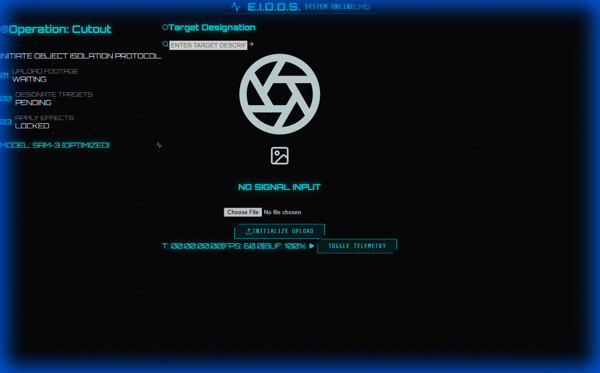
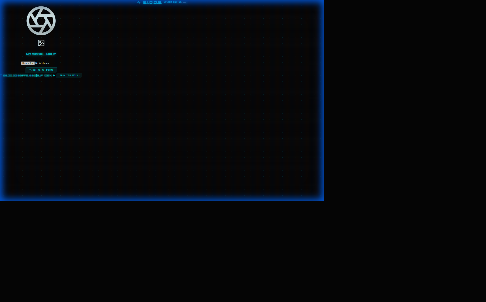

# Project E.I.D.O.S. - Emergency Intelligence & Dynamic Object Search


**Project E.I.D.O.S.** is a next-generation tactical intelligence platform designed for real-time object tracking and analysis. It leverages the state-of-the-art **Meta SAM 3 (Segment Anything Model 3)** to provide instant, high-fidelity segmentation and tracking in a "Command Center" style interface.

## 🚀 Features

*   **Neural Bridge Engine**: A custom Python backend wrapping the official Meta SAM 3 model for real-time inference.
*   **Tactical HUD Interface**: A futuristic, sci-fi inspired frontend built with React, Vite, and Tailwind CSS.
*   **Video Analysis**: Full support for `.mp4` video uploads with frame-by-frame processing and real-time progress tracking.
*   **Cinematic Mode**: "Toggle Telemetry" feature to hide HUD elements for a clean, unobstructed view of the processed footage.
*   **Real-Time Telemetry**: Simulated system status, network latency, and operational metrics.


## 🎥 Video Intelligence

The system now includes a dedicated **Video Workspace** for analyzing dynamic footage.

*   **Async Processing**: Videos are processed in the background without freezing the UI.
*   **Progress Tracking**: Watch the analysis progress in real-time.
*   **Target Designation**: Specify targets (e.g., "drone", "vehicle") for automated highlighting.



### Cinematic Mode (Telemetry Off)


## 🛠️ Architecture

The project consists of two main components:

1.  **Frontend (`/frontend`)**:
    *   **Tech Stack**: React, Vite, Tailwind CSS, Framer Motion.
    *   **Role**: The user interface (Command Center). It communicates with the backend via REST API.
    *   **Theme**: "Deep Space" dark mode with Neon Cyan accents and CRT scanline effects.

2.  **Backend (`/backend`)**:
    *   **Tech Stack**: Python, FastAPI, PyTorch, Meta SAM 3, OpenCV.
    *   **Role**: The "Neural Bridge". It loads the heavy SAM 3 model into memory and exposes endpoints for image/video analysis.
    *   **Integration**: Directly imports the `sam3` codebase (patched for Windows compatibility).

## 📦 Installation

### Prerequisites
*   Node.js (v16+)
*   Python (v3.10+)
*   CUDA-enabled GPU (Recommended)

### 1. Clone the Repository
```bash
git clone https://github.com/DSeahYS/Project-E.I.D.O.S.-Emergency-Intelligence-Dynamic-Object-Search.git
cd Project-E.I.D.O.S.-Emergency-Intelligence-Dynamic-Object-Search
```

### 2. Setup Backend (The Neural Bridge)
```bash
# Create virtual environment
python -m venv venv
source venv/bin/activate  # On Windows: venv\Scripts\activate

# Install dependencies
pip install -r backend/requirements.txt

# Launch the Engine
python backend/main.py
```
*The server will start on `http://localhost:8000`.*

### 3. Setup Frontend (The Command Center)
```bash
cd frontend
npm install
npm run dev
```
*The UI will launch on `http://localhost:5173`.*

## 🎮 Usage

1.  **Launch Mission Control**: Open the frontend in your browser.
2.  **Check Status**: Verify that the "NEURAL BRIDGE" status in the top right corner says **ONLINE**.
3.  **Target Acquisition**: Click on the "TARGET ACQUISITION" card to enter the Video Workspace.
4.  **Analyze**: Upload footage (`.mp4` or images) and use the HUD tools to designate targets.
5.  **Cinematic Mode**: Click "TOGGLE TELEMETRY" to hide the UI for a better view of the results.

## 🔧 Troubleshooting

*   **"Neural Bridge: OFFLINE"**: Ensure the backend server is running on port 8000.
*   **Video Stuck at 0%**: Ensure you have the latest backend code with the `process_video` method in `engine.py`.
*   **SAM 3 Import Errors**: The backend includes patches for Windows compatibility (bypassing Triton). If you are on Linux, you can remove these patches in `sam3/train/loss/sigmoid_focal_loss.py`.

## 📜 License

This project is licensed under the MIT License. SAM 3 code is subject to Meta's original license.
